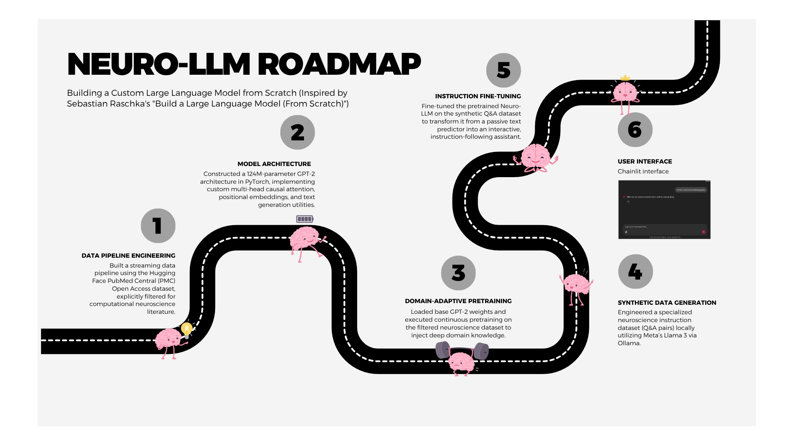

# Neuro-LLM: Domain-Specific Large Language Model from Scratch

## Overview
Neuro-LLM is an end-to-end, custom-built Large Language Model (124M parameters) specialized in computational neuroscience. Inspired by Sebastian Raschka's *Build a Large Language Model (From Scratch)*, this project implements a GPT-2 architecture entirely in PyTorch. 

The project spans the full machine learning lifecycle: from building a custom Hugging Face data streaming pipeline and coding causal multi-head attention mechanisms, to domain-adaptive pretraining, synthetic instruction data generation with Llama 3, and final deployment in a conversational Chainlit UI.

## Tech Stack
* **Framework:** PyTorch (MPS optimized for Apple Silicon)
* **Architecture:** GPT-2 (124M Parameters)
* **Data Pipeline:** Hugging Face Datasets (`datasets`), Tiktoken (BPE Tokenizer)
* **Synthetic Data Generation:** Ollama (Llama 3)
* **Frontend UI:** Chainlit

## Project Pipeline

### 1. Data Preparation & Streaming
Instead of loading massive datasets into RAM, the project utilizes an `IterableDataset` to stream the PubMed Central (PMC) Open Access dataset from Hugging Face. A custom filter isolates computational neuroscience articles (e.g., EEG, fMRI, Brain-Computer Interfaces). The text is chunked using a sliding window approach with Tiktoken's BPE tokenizer to form strictly shaped `[batch_size, context_length]` tensors.

### 2. Core Architecture
The model is built completely from scratch in PyTorch without relying on pre-packaged transformer libraries. Key components include:
* Token and Positional Embeddings
* Multi-Head Causal Attention with upper-diagonal masking
* Feed-Forward Neural Networks with GELU activations
* Layer Normalization and Dropout for regularization

### 3. Domain-Adaptive Pretraining
Base GPT-2 (124M) weights are loaded into the custom architecture. The model is then continuously pretrained on the filtered neuroscience dataset. This shifts the model's internal probability distributions away from general internet text and heavily towards biomedical and neuro-scientific terminology.

### 4. Synthetic Data Generation
To transition the model from a "document completer" to a conversational assistant, an instruction dataset was required. Using a local instance of Meta's Llama 3 running via Ollama, a dataset of 500+ specialized neuro-scientific Q&A pairs was generated and formatted into a JSON schema (`instruction`, `input`, `output`).

### 5. Instruction Fine-Tuning
The domain-adapted model was fine-tuned on the synthetic Q&A dataset using the Alpaca prompt template. Training parameters (e.g., `lr=1e-5`, custom masking with `ignore_index=-100` for padding tokens) were heavily optimized to prevent forgetting of the pretraining data while adapting to the conversational format.

### 6. User Interface
The finalized `neuro_model_instruct_weights.pth` weights are loaded into a ChatGPT-style web interface using Chainlit. The inference script includes Temperature Scaling and Top-K sampling to reduce repetition loops, providing smooth, interactive responses.

## Key Learnings & Future Work
* **Mitigating Overfitting:** Fine-tuning a small 124M parameter model on a highly specialized 500-pair dataset leads to rapid format adaptation but risks overfitting (where validation loss diverges from training loss). 
* **Next Steps:** Expand the synthetic Q&A dataset to 2,000+ pairs, increase weight decay (`0.2`), and implement early stopping to improve factual generalization. 

## Acknowledgments
* **[Sebastian Raschka](https://github.com/rasbt/LLMs-from-scratch/tree/main)** for the foundational PyTorch LLM implementation concepts.